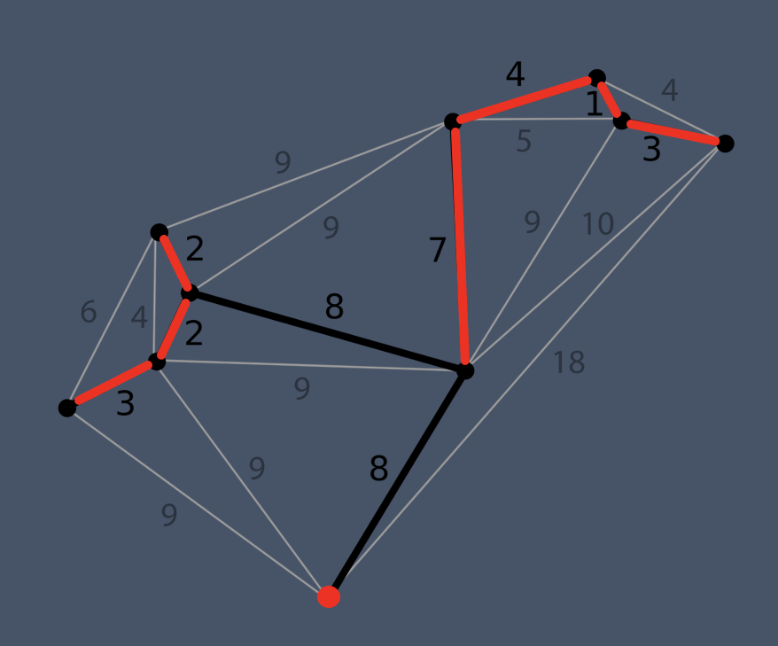

# MinimumSpanningTree

Spanning trees and Minimum Spanning Trees (MSTs) are fundamental objects in graph theory, and are used in many different applications. This project explores the use of MST as a basis for clustering algorithms, and the performance of these algorithms with respect to other heuristics (e.g., k-means).

## Definition
Given a graph G = (V, E), a spanning tree for G, denoted T , is a tree (i.e., a graph in which every pair of vertices is connected by way of one and only one path) such that every vertex v ∈ V is part of it. In other words, it is a subgraph T ⊂ G that contains all vertices in G, is connected and is acyclic.
Given a weighted graph G = (V, E, w), where w(e) is the weight of edge e ∈ E, the minimum spanning tree is the spanning tree of G with minimum weight.

*Example of MST over a weighted graph*

Several algorithms have been implemented to, if exists, compute the MST of a given graph:

* Boruvska 
* Prim
* Kruskal

Different tests available:
* boostgraph_test.cpp (constructor of the graph)
* kruskal_test.cpp
* prim_test.cpp
* boruvka_test.cpp
* k_clusters_test.cpp (compute clusters from the MST)
* mipiprimtest.cpp

Any file from "tests_files" can be used to construct a graph with the default constructor boostgraph(std::string file).

